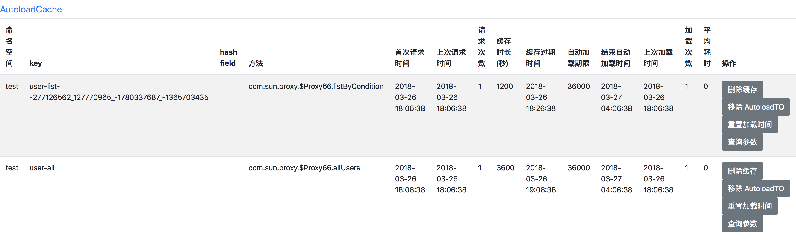

# autoload-cache-spring-boot-starter
---------------------------------------------

使用说明：

### 1. Maven dependency:

    <dependency>
      <groupId>com.github.qiujiayu</groupId>
      <artifactId>autoload-cache-spring-boot-starter</artifactId>
      <version>${version}</version>
    </dependency>

### 2. 配置请参考[AutoloadCacheProperties](./src/main/java/com/jarvis/cache/autoconfigure/AutoloadCacheProperties.java)

### 3. 依赖注入请参考[AutoloadCacheManageConfiguration](./src/main/java/com/jarvis/cache/autoconfigure/AutoloadCacheManageConfiguration.java)

如果出现AOP相关的错误，参考[https://github.com/qiujiayu/autoload-cache-spring-boot-starter/issues/1](https://github.com/qiujiayu/autoload-cache-spring-boot-starter/issues/1)

### 4. 管理工具

通过[http://localhost:8080/autoload-cache-ui.html](http://localhost:8080/autoload-cache-ui.html) 进入管理页面：

@Transactional 与 @Cache 同时使用到同一个类中时：

在实现接口的情况下：

1. 当@EnableTransactionManagement(proxyTargetClass = true)时 @Cache注解必须加在class方法中;
2. @EnableTransactionManagement(proxyTargetClass = false)时, @Cache注解必须加在interface及class中都可以;

总结：除Mybatis Mapper接口外，尽量将@Cache注解必须加在class方法中。
