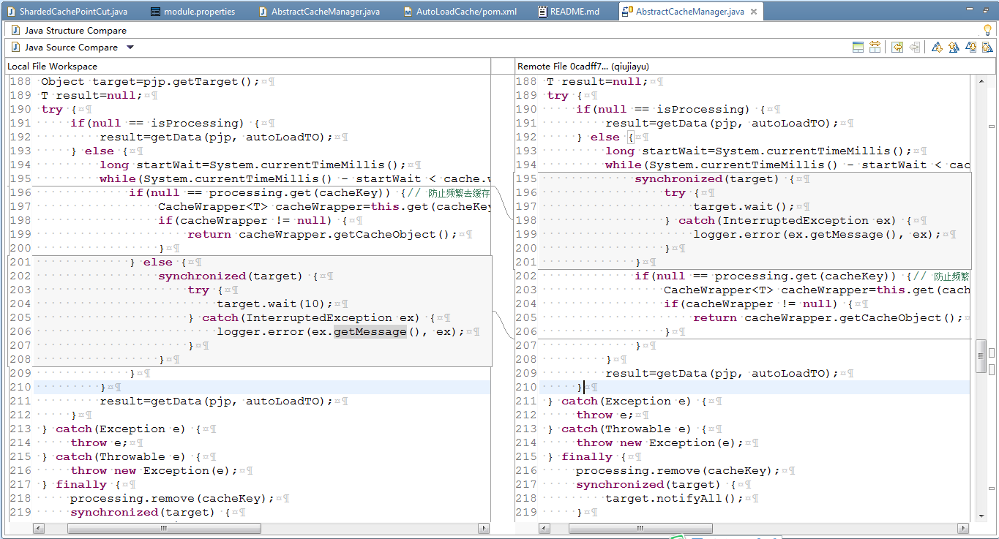

##更新日志

* ####4.14 修改说明

    * 使用lombok来缩减代码,Lambok能帮助我们减少写get,set,hashCode,toString等没有技术含量的工作，而且在修改增加或删除java bean中的属性时，不需要去改hashCode，toString等方法，减少因为忘记修改而造成的错误。
    * 增加OGNL表达式引擎支持，经过测试它的性能要比SpringEL表达式还要优秀。测试代码在：com.test.script.ScriptTest

* ####4.13 修改说明

    * com.jarvis.cache.clone.ICloner中的Object deepClone(Object obj) 改为 Object deepClone(Object obj, final Type type)，在能获得Type的情况下使用，能更好保证数据准备和效率
    
    * 进一步优化深度复制功能，因为深度复制的目的主要是用于防止外部修改已经缓存的数据，对于一些不可变对象，就可以直接使用，不再走clone逻辑。
    
    * 增加Jackson支持
    
    * 将CacheKeyTO中所有属性改为final，同时删除fullKey属性。同时增加hashCode和equals两个方法的实现
    
    * 修复DataLoader中，等待第一个请求获取数据后，又再去数据层获取数据的BUG，这个BUG是在4.11版本产生的，建议使用4.11和4.12的用户升级一下。

* ####4.12 修改说明：

    * fastjson deepClone 数组中有Map或Collection时，转换失败的问题
    * Fastjson深度复制优化：针对深度复制Method的arguments进行优化，通过method.getGenericParameterTypes() 来方便深度复制泛型参数。
    * 使用 ThreadLocal 缓存Random，提升获取随机数性能
    * 将异步刷新线程设置为守护线程。
    * ICacheManager中的get和set方法中，增加Method method和 Object args[]两个参数，方便使用者根据情况进行扩展，比如：增加一些自定义的注解，来处理特殊业务逻辑（比如：增加本地缓存功能）

* ####4.11 修改说明：

    * 增加刷新缓存数据功能，如果不使用自动加载，则在缓存即将过期时，开启线程进行异步刷新数据，可以减少用户的等待，避免因缓存失效失效造成系统压力过大；
    * 在刷新缓存和自动加载缓存中，如果从数据层加载数据时，发生异常，则使用旧数据进行续租（如果有旧数据的话），达到提前预防缓存失效后，系统压力过大问题；
    * 解决使用fastjson进行深度复制数据组时，转换错误的问题；
    * 增加使用cloning进行深度复制，性能要比fastjson提高50%。相关的测试代码在：com.test.fastjson.CloningTest和com.test.fastjson.DeepCloneTest两个类中；
    * 将数据加载功能从AbstractCacheManager中移到DataLoader中，使得代码更加清晰易懂；

* ####4.10 增加使用Fastjson进行序列化的支持，同时也增加了对比较大的数据进行压缩的工具。

* ####4.9 去除默认的serializer和scriptParser，以便于与Spring 进行强解耦。

* ####4.8 优化JavaScriptParser 中的代码，并根据JDK版本，使用javascript 还是nashorn 引擎。

* ####4.7 修改说明：

    * 修改缓存预警时间值，加入-10~10秒随机数，避免缓存集中失效
    * 实现表达式引擎的可扩展性，默认还是使用SpringEL表达式引擎（com.jarvis.cache.script.SpringELParser），但可以自己实际情况进行扩展。扩展方法：实现com.jarvis.cache.script.IScriptParser,然后通过配置把实现的实例注入到AbstractCacheManager中的scriptParser属性即可。使用不同表达式引擎时，注意表达式的语言的区别。
    * 增加了JavaScript 表达式引擎实现：com.jarvis.cache.script.JavaScriptParser。如果项目使用JDK1.8的，想用JavaScript的话，建议使用Nashorn 来实现，性能会比较好。

* ####4.6 修改说明：

    * @Cache中增加 expireExpression，实现通过表达式来动态获取expire 值；
    * @Cache 中增加 alarmTime。当缓存在alarmTime 时间内即将过期的话，会自动刷新缓存内容；
    * 解决 hessian2 无法序列化SoftReference 的bug；

* ####4.5 修改说明：

    * 调整CacheTask 中 Thread.sleep(0); 的位置；
    * 增加CacheChangeListener 接口，优化代码结构；
    * 使用SoftReference 管理Map中的缓存数据；

* ####4.4 修改说明：

    当遍历次数达到2000时，执行Thread.sleep(0); 触发操作系统立刻重新进行一次CPU竞争, 让其它线程获得CPU控制权的权力。

    com.jarvis.cache.map.CachePointCut 做如下修改
    * 将 boolean cacheChaned 改为 缓存被修改的计数器（AtomicInteger cacheChanged）
    * 增加属性：int unpersistMaxSize，允许不持久化变更数(当缓存变更数量超过此值才做持久化操作)
    * 增加属性: boolean copyValue;是否拷贝缓存中的值：true时，是拷贝缓存值，可以避免外界修改缓存值；false，不拷贝缓存值，缓存中的数据可能被外界修改，但效率比较高。

* ####4.3 对 ConcurrentHashMap 缓存增加持久化功能。重启时会从本地磁盘加载缓存数据，避免因刚启动没有缓存数据，造成压力过大。

* ####4.2 改用JDK1.6进行编译；将isAutoload中的cache.expire() > 120 改为 cache.expire() >= 120；

    AutoLoadHandler中排序线程增加sleep，以节约系统资源
  
* ####4.1 提升缓存管理页的扩展性

    将获取AOP配置信息功能从 AdminServlet 中抽取出来，并使用CacheManagerConfig接口来获取。

* ####4.0 实现AOP的可扩展

    受网友Rekoe 将AutoLoadCache 和 nutz整合的启发([https://github.com/Rekoe/AutoLoadCache](https://github.com/Rekoe/AutoLoadCache))，将AutoLoadCache 中的AOP相关功能进行抽取，以达到可扩展

    * 把AOP拦截方法从AbstractCacheManager中抽取出来，并使用CacheAopProxyChain 和 DeleteCacheAopProxyChain 两个代理类进行封装拦截到的请求。
    * 实现了使用Aspectj进行AOP拦截：com.jarvis.cache.aop.aspectj.AspectjAopInterceptor
    * 升级时一定要注意配置文件的变化，可以参考[cache-example](https://github.com/qiujiayu/cache-example) 中的配置

* ####3.7 细节优化：

    * 调整 写缓存（writeCache）代码结构。
    * 将ShardedCachePointCut中hashExpire默认值设置为-1；
    * 解析SpEL表达式时，增加判断是否有返回值，避免在不能使用#retVal的地方，使用了#retVal
    * 将com.jarvis.cache.map.CachePointCut.shutDown() 改成  destroy()

* ####3.6  对@ExCache相关代码进行调整，自动加载时也对@ExCache进行处理。对一些变量增加volatile 修饰符，以便于其它线程的读取到最新的值。

* ####3.5  增加如下几个功能：

    * 注册自定义Spring EL表达式函数
    * 如果ShardedCachePointCut 中的 hashExpire 小于0则使用@Cache中设置的expire值，替换hashExpire值。
    * 增加@ExCache，用于增强@Cache 设置缓存功能。应用场景举例：我们使用getUserByName时，返回User的对象，其实也可以设置给getUserById的缓存中的，反过也是同样的道理，通过getUserById方法返回的数据，也可以设置给getUserByName的缓存中​，这样可以减少与DAO的交互了。

* ####3.4  使用管道来操作Redis 的哈希表，减少与Redis的交互次数。

* ####3.3  增加 Spring EL 表达式（Expression）缓存。

* ####3.2 进一步优化“拿来主义”机制

    使用当前的ProcessingTO来做同步锁，把锁粒度降到了最低，以提升并发性能；删除并发线程的计数器；如果第一个线程执行时出现异常，那等待中的线程，也直接抛出异常，因为此时去执行DAO的出错的可能性非常大，会造成服务器压力过大。

* ####3.1 优化“拿来主义”机制

    “拿来主义”机制指的是，当有多个请求去获取同一个数据时，我们先让其中一个请求先去DAO中获取数据，并放到缓存中，其它请求则等它完成后，直接去缓存中获取数据，通过这种方式减轻DAO中的并发。

    但经测试发现，刚往Reids中放的数据，立即去取是获取不到数据的（无法命中），测试代码已经放到[cache-example](https://github.com/qiujiayu/cache-example) 中。优化后的方案是，不从远程服务器获取，而是从本地内存中获取第一个请求返回的数据。减少并发的同时，还能减轻网络压力。

* ####3.0 此版本做了大调整，有些功能已经不兼容老版本 

    不再使用默认缓存Key，所有的缓存都必须自定义缓存Key；原来使用$hash()来调用hash函数，改为使用#hash()进行调用。

    之前版本中使用通配符（?和*）进行批量删除缓存，这种方法性能比较差，需要多次与Redis进行交互，而且随着缓存Key的数量的增加，性能也会下降，如果有多个Reids实例的话，还需要遍历每个实例。为了解决这个问题，我们使用hash表保存需要批量删除的缓存，要批量删除缓存时，只要把hash表删除就可以了。

    如果在开发阶段不想使用Redis来缓存数据，可以使用com.jarvis.cache.map.CachePointCut，把数据缓存到本地内存中，虽然它不支持使用通配符进行批量删除缓存，但同样支持使用hash表进行批量删除缓存。所以转用Redis缓存数据是没有任务问题的。

    如果需要在MyBatis Mapper中使用@Cache和@CacheDelete，则需要使用com.jarvis.cache.mybatis.CachePointCutProxy 来处理。

* ####2.13 优化多线程并发等机制, 代码调整如下：

    

    由于我们这里要实现的功能是，当前的线程要等待前一个正在运行线程的结果，但我们不知道前一个线程的执行到哪一步。有可能在我们要执行wait时，已经完成notifyAll了。通过调整逻辑变得更加严谨。

* ####2.12 解决jdk1.8之前中 java.lang.NoSuchMethodError: java.util.Map.putIfAbsent 错误。

* ####2.11 @CacheDeleteKey中keyType 设置default，以实现向下兼容。

* ####2.10 修改记录： 

    * 优化ConcurrentHashMap 使用，将以下代码：

            Boolean isProcessing=null;
            try {
                lock.lock();
                if(null == (isProcessing=processing.get(cacheKey))) {// 为发减少数据层的并发，增加等待机制。
                    processing.put(cacheKey, Boolean.TRUE);
                }
            } finally {
                lock.unlock();
            }

          改为：

            Boolean isProcessing=processing.putIfAbsent(cacheKey, Boolean.TRUE);// 为发减少数据层的并发，增加等待机制。

    * 放弃使用 @CacheDeleteKey中keyType， 直接使用它的value值来判断是自定义缓存Key，还是默认生成的缓存Key。所以keyType 变得多余了。

* ####2.9 修复以下几个问题 

    * @Cache(expire=0, waitTimeOut=500),当expire=0时，将设置为永久缓存；waitTimeOut 用于设置并发等待时间(毫秒)。

    * 增加自动加载，单个线程内的等待时间间隔：

            <bean id="autoLoadConfig" class="com.jarvis.cache.to.AutoLoadConfig">
              ... ...
              <property name="autoLoadPeriod" value="50" /><!--默认值50ms-->
            </bean>

    * 优化AbstractCacheManager类的loadData方法中线程同步锁。

* ####2.8 com.jarvis.lib.util.BeanUtil.toString()方法中增加反射缓存，提升反射效率

* ####2.7 当参数类型为 Class，自动生成的缓存Key会出问题。（感谢zhaopeng 提供的代码）

* ####2.5 2.6 当autoload=true，缓存Key中没有加上命名空间，对1.9及以上版本有影响

* ####2.4 Jedis更新到2.8

* ####2.3 AdminServlet 增加登录用户名和密码；

* ####2.2 解决Hessian不能正确序列化BigDecimal问题

* ####2.1 对Kryo进行测试，发现问题问题比较多，所以删除Kryo 支持，用户可以根据自己的情况实现ISerializer接口。优化HessianSerializer，提升性能，并将HessianSerializer作为默认的序列化和反序列化工具。

* ####2.0 增加了Hessian 和 Kryo 序列化支持，还是使用JDK自带的处理方法。修改方法如下：
    
        <bean id="jdkSerializer" class="com.jarvis.cache.serializer.JdkSerializer" />
        <bean id="hessianSerializer" class="com.jarvis.cache.serializer.HessianSerializer" />
        <bean id="cachePointCut" class="com.jarvis.cache.redis.ShardedCachePointCut" destroy-method="destroy">
          <constructor-arg ref="autoLoadConfig" />
          <property name="serializer" ref="hessianSerializer" />
          <property name="shardedJedisPool" ref="shardedJedisPool" />
          <property name="namespace" value="test" />
        </bean>

    虽然Kryo效率比较高，但使用Kryo会出现的问题比较多，所以还是慎重使用，系统经常维护的就不太适合使用，经过测试，改变属性名称，或删除中间的属性等情况都可能反序列出错误的值，所以如果遇到有减少或修改的情况要及时清里缓存。如果是增加属性则会反序列化失败，这正符合我们的要求。

* ####1.9 增加了命名空间，避免不同的系统之支缓存冲突